# 🇯🇵 Nihongo Mate – Flashcard JP

> Ứng dụng học **từ vựng & ngữ pháp tiếng Nhật JLPT (N5 → N1)** qua flashcard, quiz và nghe phát âm chuẩn.  
> Xây dựng bằng **React Native CLI + TypeScript** – nhanh, mượt và hỗ trợ học offline. ⚛️📱

<p align="center">
  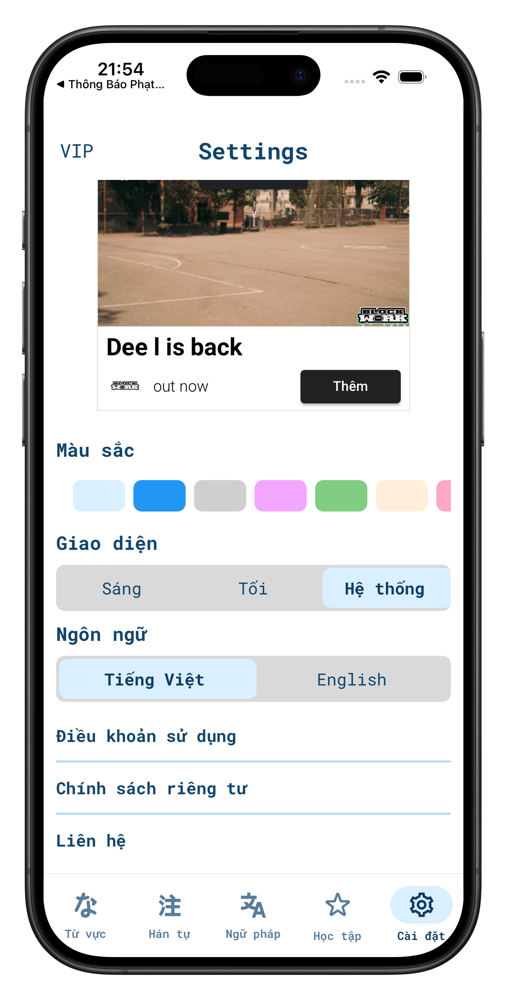
  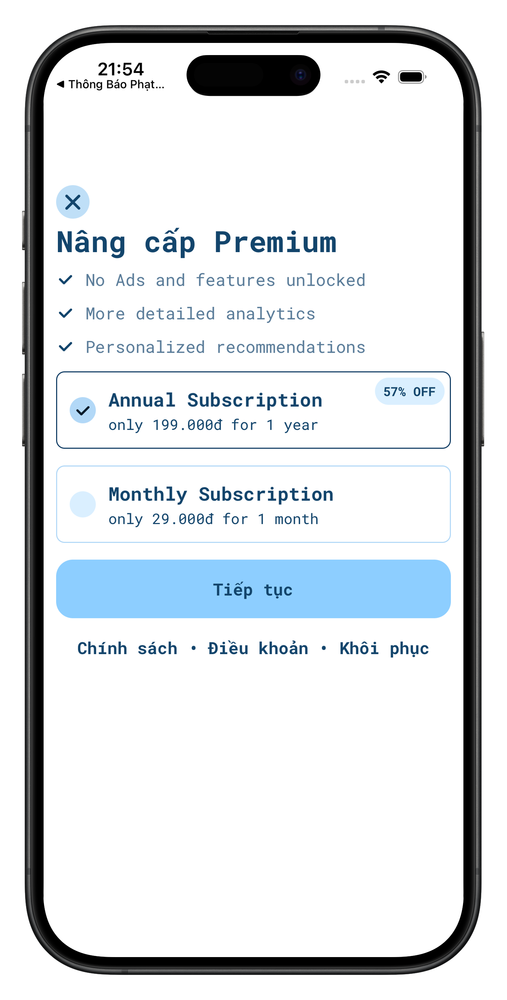
  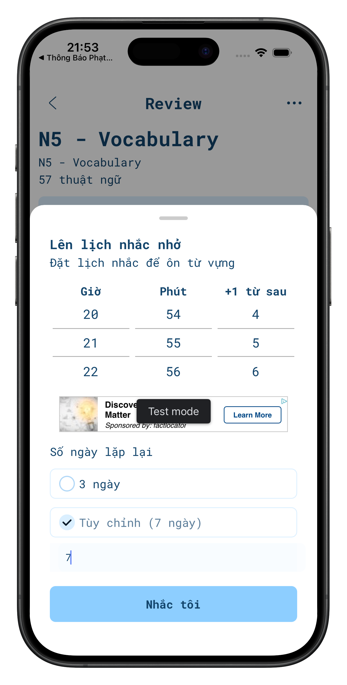
</p>
<p align="center">
  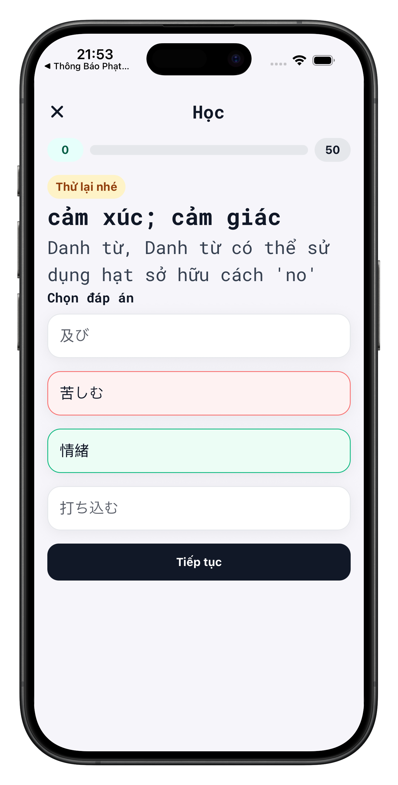
  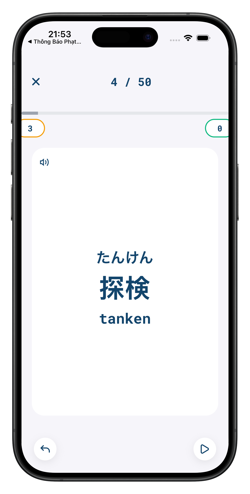
  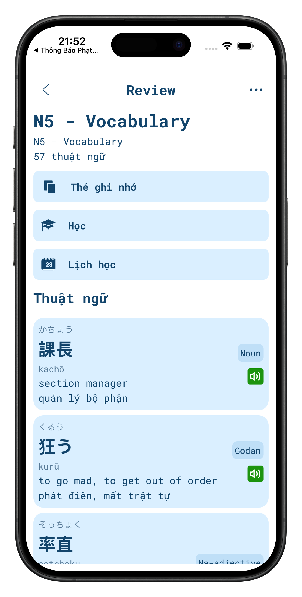
</p>
<p align="center">
  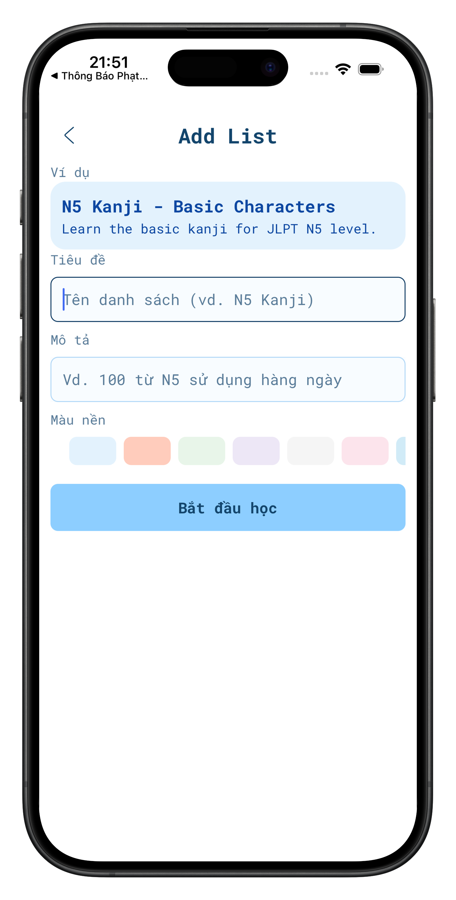
  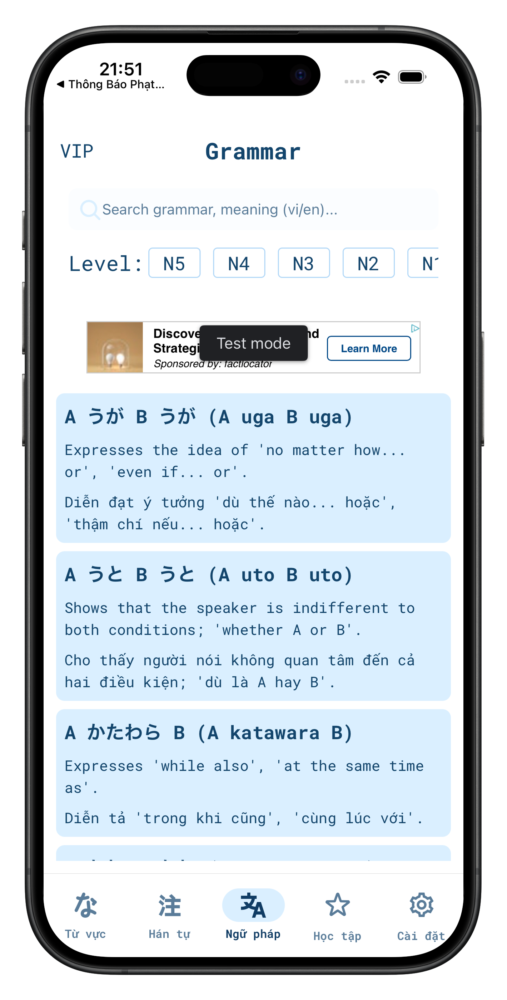
  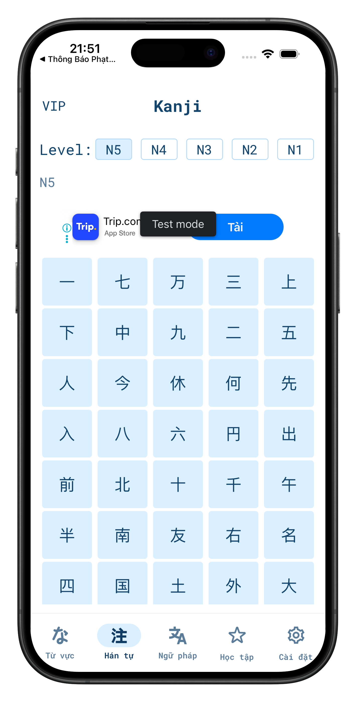
</p>

<p align="center">
  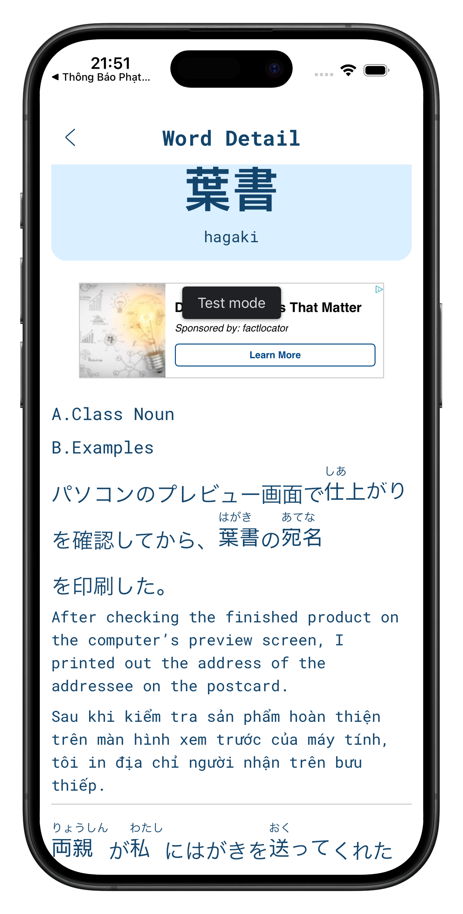
  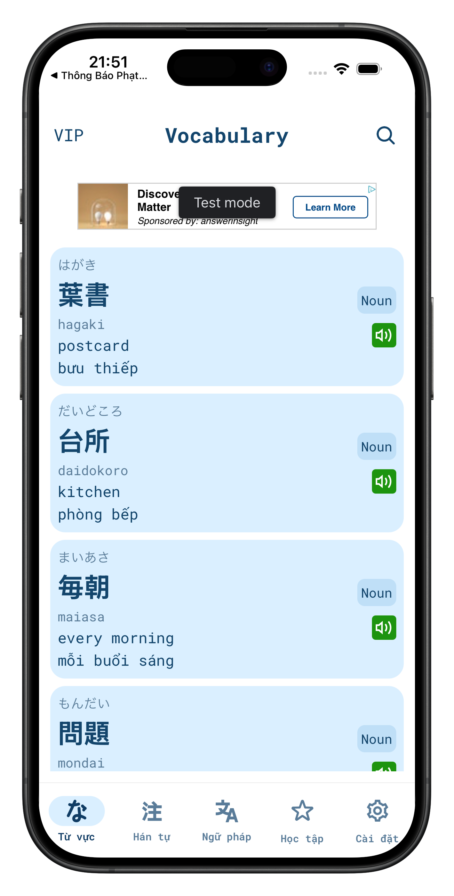
</p>

---

## 🌟 Giới thiệu

**Nihongo Mate** là trợ lý học tiếng Nhật thân thiện dành cho người Việt.  
Bạn có thể học mọi lúc mọi nơi — chỉ cần mở app, lật flashcard, nghe ví dụ và làm quiz củng cố kiến thức.  
Ứng dụng được thiết kế với mục tiêu: **“Nhẹ, đẹp, dễ dùng và học vui.”**

---

## 🎴 Tính năng nổi bật

- 🈶 **Từ vựng JLPT N5 → N1** (18 000 + từ) có nghĩa tiếng Việt  
- 🗣️ **Phát âm chuẩn Nhật Bản** (TTS + audio thật)  
- 🧩 **Ngữ pháp có ví dụ song ngữ** + link audio  
- 🧠 **Quiz trắc nghiệm** luyện nhanh sau mỗi chủ đề  
- 🪄 **Flashcard Animation mượt** bằng Reanimated 3  
- 🌗 **Dark / Light / Custom Theme** 16 màu khác nhau  
- 📦 **Tải âm thanh + dữ liệu offline** (Realm DB + Cloudflare R2)  
- 🏆 **Gói VIP Subscription** (RevenueCat API verify server side)  
- 🌍 **Đa ngôn ngữ** (vi, en, ja, ko, fr, de, es, pt, ru, zh, th, id, ms, hi)  
- 🔔 **Thông báo ôn tập hằng ngày + đồng bộ progress**

---

## 🧱 Công nghệ chính

| Nhóm | Công nghệ |
|------|------------|
| **UI/UX** | React Native CLI, TypeScript, FlashList, Reanimated 3, Gesture Handler, Lottie |
| **Dữ liệu** | Realm DB (offline sync), Cloudflare R2, JSON assets |
| **API** | Node.js + Express + Redis cache |
| **Thanh toán VIP** | RevenueCat SDK / REST API |
| **Build & DevOps** | Gradle, CocoaPods, Xcode, Android Studio |
| **Localization** | i18next + JSON translations |

---

## ⚙️ Cài đặt và chạy

### 1️⃣ Clone dự án
```bash
git https://github.com/giahyng1502/JR---FlashCard
cd nihongo-mate
